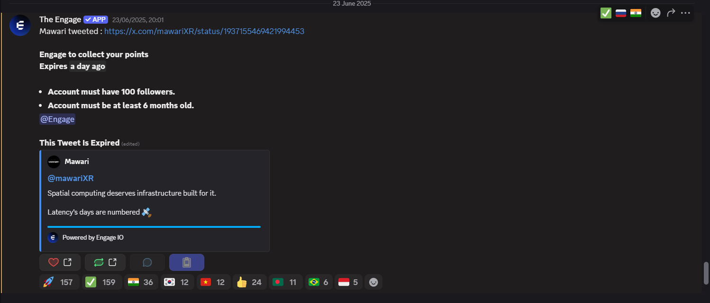
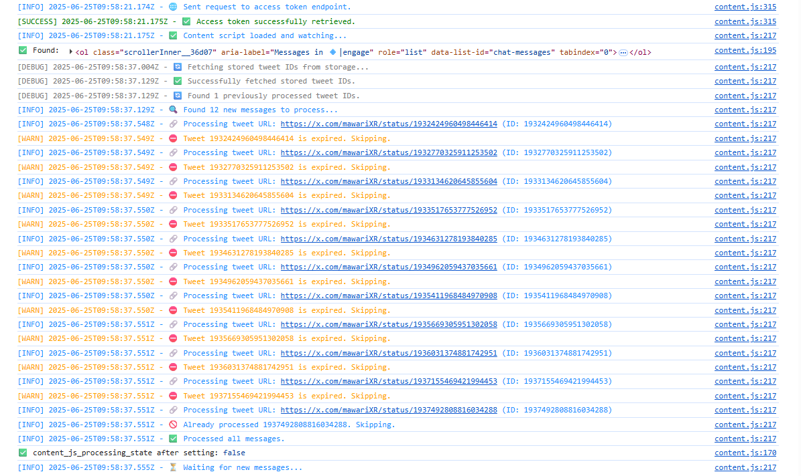
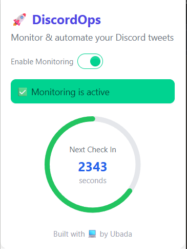

# 🤖 DiscordOps Chrome Extension (CUSTOMIZABLE)


A powerful and customizable **Chrome Extension** built for browser automation — featuring:

* 🔎 **Discord message monitoring**
* 🐦 **Twitter tweet engagement**
* 💬 **Real-time message parsing and event-based actions**
* 🧠 **Intelligent script injection and flow control**

> ⚠️ **Note:** This extension is not intended for public use. It is tailored for internal admin-controlled automation flows and showcases advanced automation patterns. For demo purposes only.

---

## 📦 Features

* 📥 Monitors specific Discord channels for targeted content
* 🧠 Extracts tweet links and opens them in a new tab
* ✨ Performs Twitter interactions like Like, Retweet, and Reply
* ✅ Prevents duplicate processing using local storage
* 🔄 Fully async and event-driven communication between tabs and background scripts
* 🛡️ Backend API is protected and restricted to admin devices only

---

## 🚀 Tech Stack

* 🧩 Chrome Extensions (Manifest V3)
* ⚙️ Service Workers & Content Scripts
* 🌐 Web Scraping, For UI React & DOM Interactions
* 🔐 Secured with Device ID & Access Tokens
* 📝 Deep logging for each step (color-coded)

---

## 🔐 Access & Usage

This project is:

* 🚫 Not intended for general users
* 🔐 Restricted to admin devices through backend validation
* 🧪 Built for showcasing automation patterns using Discord + Twitter

If you're interested in building something similar — or want this adapted for your use case — feel free to reach out! 💬

---

## 📁 Repository Contents

```
📦 discordops-extension/
 ┣ 📂 public/
 ┃ ┗ 📄 icons, manifest.json
 ┣ 📂 src/
 ┃ ┣ 📄 content.js
 ┃ ┣ 📄 background.js
 ┃ ┗ 📄 tweetAction.js
 ┣ 📄 .env.example
 ┣ 📄 README.md
 ┗ 📄 discordops.crx
```

---

## ✨ Showcase Ready — Production Locked

This project is safe to showcase. All backend interaction is admin-locked 🔒 and API abuse is prevented by design.

---

## 📬 Contact & Collaboration

Want to collaborate, request modifications, or build your own browser automation flow?

* 📩 **Reach out to me directly** for access, customization, or consultation
* 🛠️ **Need automation for Discord, Twitter, or other browser flows?** Let's talk!

---

## 🖼️ Screenshots

> A quick glimpse into the automation in action. The Automation Flow might be change person to person requirements so below is only for the admins

### 🔍 1. Discord Message Detection


### ⚙️ 2. Console Log Debugging


### 🐦 3. Extension Popup UI



---

Made with ❤️ for browser automation enthusiasts.
